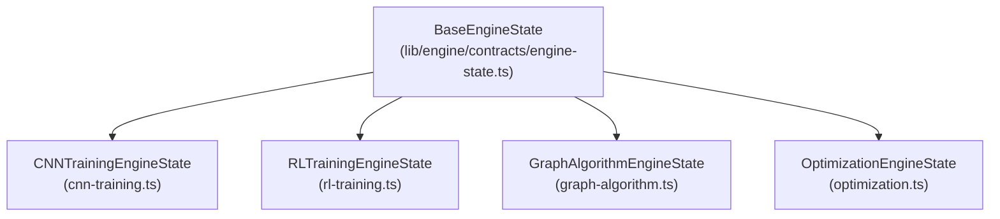

# Engine State Contracts Specification

**Document Version:** 1.0.0  
**Status:** Canonical Engine API Specification  
**Target Path:** `doc/architecture/engine-state-contracts.md`  
**Phase:** Phase 1.3 Engine State Contracts  

---

## 1. Overview & Purpose

The **Engine State Contracts** layer (`lib/engine/contracts/`) defines a domain-independent, framework-agnostic, frozen API contract between simulation engines and visualizer plugins.

### Core Guarantees
1. **Decoupled & Standalone:** Engine contracts have ZERO dependencies on React, HTML DOM, framework tensors (`torch`, `tf`), or Knowledge Objects.
2. **Strictly Serializable:** Engine state interfaces contain only serializable primitive numbers, booleans, strings, arrays, and plain objects.
3. **Domain Extensibility:** Defines specialized contracts for CNN Training, Reinforcement Learning, Graph Algorithms, and Optimization.
4. **Visualizer Contract:** Standardizes visualizer engine compatibility verification (`supports(engineState)`).

---

## 2. Engine State Hierarchy



---

## 3. Visualizer & Event Contracts

### 3.1 `VisualizerEngineContract`
```ts
export interface VisualizerEngineContract {
  readonly supportedEngineStates: readonly string[];
  readonly priority: number;
  readonly requiredCapabilities: Partial<EngineCapabilities>;
  supports(engineState: BaseEngineState): boolean;
}
```

### 3.2 `EngineEvent`
Standardizes engine notifications (`EngineStarted`, `EngineStopped`, `EngineUpdated`, `EpochCompleted`, `EpisodeCompleted`, `StateChanged`).
