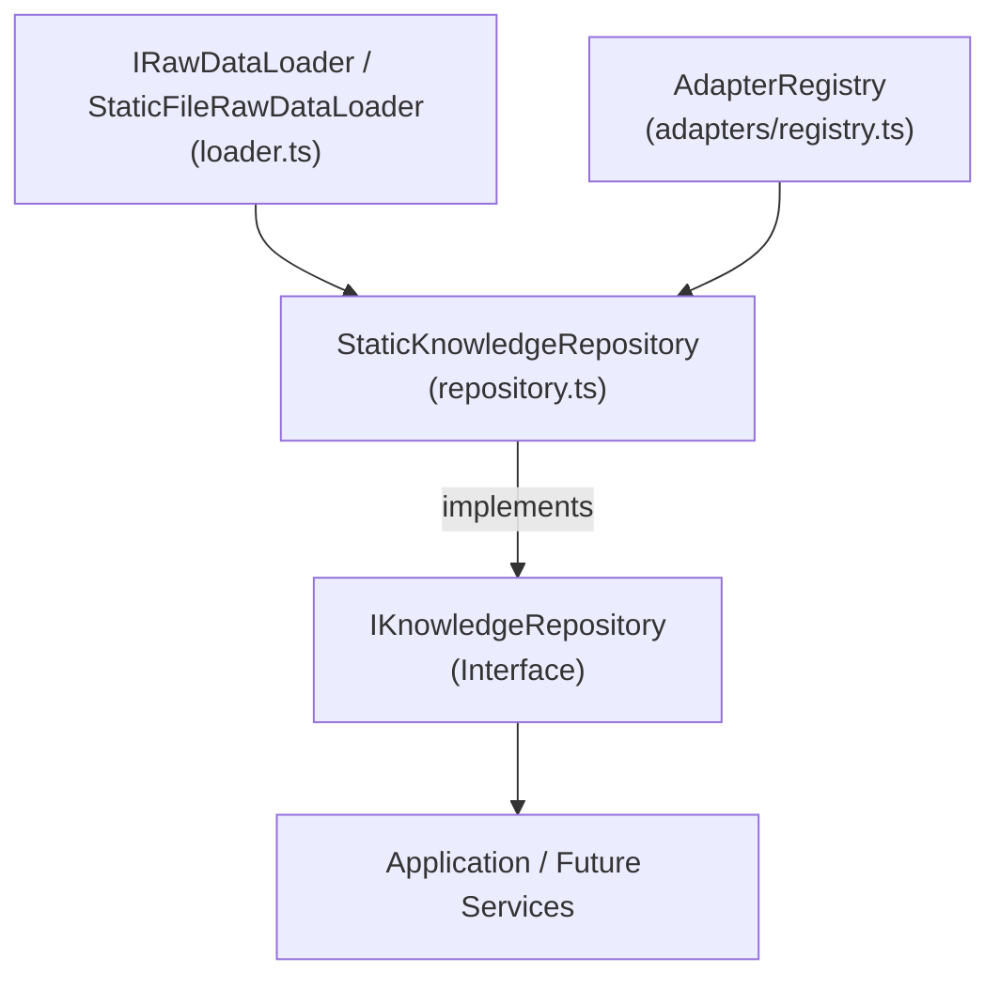

# Knowledge Repository Architecture Specification

**Document Version:** 1.0.0  
**Status:** Canonical Knowledge Repository Specification  
**Target Path:** `doc/architecture/knowledge-repository.md`  
**Phase:** Phase 1.5 Knowledge Data Access  

---

## 1. Executive Summary & Purpose

The **Knowledge Repository Layer** (`lib/knowledge/repository/`) provides a unified, read-only data access interface (`IKnowledgeRepository`) to retrieve Canonical Knowledge Objects across models, papers, concepts, and patterns.

### Core Architectural Guarantees
1. **Interface Abstraction (`IKnowledgeRepository`):** Callers consume an interface contract rather than a tight singleton implementation, enabling seamless future transitions to remote APIs, databases, or IndexedDB.
2. **Decoupled Data Loading (`IRawDataLoader`):** Data fetching and file system I/O are completely isolated from the repository, allowing deterministic testing with in-memory mock datasets.
3. **Readonly Collections (`readonly KnowledgeObject[]`):** Repository methods return immutable collections to prevent accidental state mutation.
4. **Normalized Relationship Queries:** Exposes relationship traversal APIs (`getRelatedObjects`, `getPrerequisites`, `getSuccessors`).

---

## 2. Repository Architecture



---

## 3. Public API Specification

```ts
export interface IKnowledgeRepository {
  getKnowledgeObject(id: string): KnowledgeObject | undefined;
  getKnowledgeObjects(): readonly KnowledgeObject[];
  getPerspective(id: string, perspectiveId: string): BasePerspective | undefined;
  getRelatedObjects(id: string): readonly KnowledgeObject[];
  getPrerequisites(id: string): readonly KnowledgeObject[];
  getSuccessors(id: string): readonly KnowledgeObject[];
  getObjectsByDomain(domainId: string): readonly KnowledgeObject[];
  getObjectsByType(type: KnowledgeObjectType): readonly KnowledgeObject[];
  getObjectsByDifficulty(difficulty: DifficultyLevel): readonly KnowledgeObject[];
  getObjectsByLearningStage(stage: LearningStage): readonly KnowledgeObject[];
}
```
