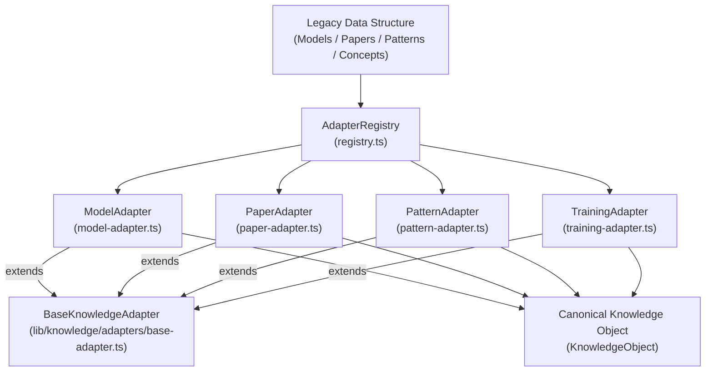

# Migration Adapters Architecture Specification

**Document Version:** 1.0.0  
**Status:** Canonical Migration Architecture Specification  
**Target Path:** `doc/architecture/migration-adapters.md`  
**Phase:** Phase 1.4 Migration Adapters  

---

## 1. Executive Summary & Purpose

The **Migration Adapters Layer** (`lib/knowledge/adapters/`) establishes a clean compatibility framework translating legacy platform entities into Canonical Knowledge Objects without modifying underlying static JSON datasets or altering existing UI component logic.

### Core Architecture Principles
1. **Shared Adapter Framework (`BaseKnowledgeAdapter`):** Avoids code duplication across domain adapters by standardizing ID normalization, metadata parsing, and Zod schema validation.
2. **Pure Transformation Functions:** Adapters perform deterministic, side-effect-free data translation (`Legacy -> KnowledgeObject`). They execute zero file I/O, network requests, state mutations, or caching.
3. **Graceful Property Ignorance:** Unknown or legacy-specific fields are ignored gracefully without throwing validation errors or cluttering canonical objects.
4. **ID & Link Preservation:** Identifiers, slugs, and normalized relationships are preserved with zero random string generation.

---

## 2. Shared Adapter Hierarchy

---

## 3. The 4 Concrete Adapters

### 3.1 `ModelAdapter` (`lib/knowledge/adapters/model-adapter.ts`)
Translates legacy model summaries and full model JSON architectures into `KnowledgeObject` instances under namespace `model:{slug}`.

### 3.2 `PaperAdapter` (`lib/knowledge/adapters/paper-adapter.ts`)
Translates research paper summaries and canonical 7-zone paper detail JSONs into `KnowledgeObject` instances under namespace `paper:{slug}`.

### 3.3 `PatternAdapter` (`lib/knowledge/adapters/pattern-adapter.ts`)
Translates design pattern metadata into `KnowledgeObject` instances under namespace `pattern:{slug}`.

### 3.4 `TrainingAdapter` (`lib/knowledge/adapters/training-adapter.ts`)
Translates training dynamics concept definitions into `KnowledgeObject` instances under namespace `concept:{slug}`.

---

## 4. Adapter Registry (`AdapterRegistry`)

Exposes automatic adapter discovery and conversion methods:
- `findAdapterForData(data: unknown): IKnowledgeAdapter | undefined`
- `convert(data: unknown): KnowledgeObject`
- `convertAll(dataArray: readonly unknown[]): KnowledgeObject[]`
