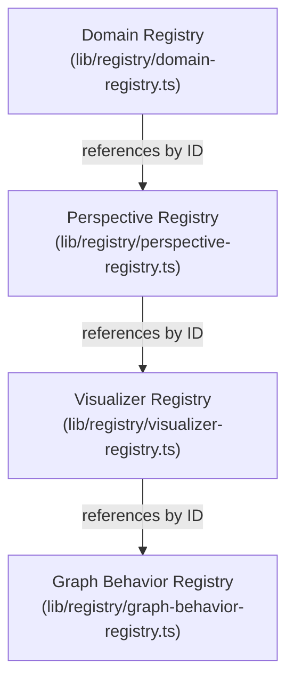

# Shared Registry Architecture: Neural Network Architecture Explorer

**Document Version:** 1.0.0  
**Status:** Canonical Platform Foundation Specification  
**Target Path:** `doc/architecture/shared-registries.md`  
**Phase:** 0.3 Shared Registries  

---

## 1. Overview & Purpose

The **Shared Registry System** introduces a centralized, strongly typed, declarative capability discovery layer for the Neural Network Architecture Explorer platform.

Prior to Phase 0.3, capability selection across the platform was implicitly coupled to Convolutional Neural Networks (Vision domain) through scattered switch statements, hardcoded arrays, and UI-level conditional logic.

The Shared Registry system eliminates domain-specific hardcoding by establishing a canonical single source of truth for platform capabilities. Every future domain—such as **Transformers**, **Reinforcement Learning**, **Graph Neural Networks**, **Optimization**, **Graph Algorithms**, **Diffusion Models**, and **Classical ML**—can be registered and discovered entirely through metadata declarations without altering platform core infrastructure or UI component code.

### Core Guarantees of the Registry Layer
1. **Metadata Only:** Declarative TypeScript objects describing capabilities without executing runtime logic or importing visual renders/engines.
2. **Zero UI & Engine Dependencies:** Pure TypeScript definitions located in `lib/registry/`. No React, Next.js, HTML, Canvas, or autograd dependencies.
3. **Compile-Time Exhaustiveness & Uniqueness:** Canonical registries are defined as frozen `Record<Id, Definition>` types using `as const satisfies Record<Id, Definition>`.
4. **Strict ID Reference Decoupling:** Registries reference external entities by strongly typed string literal IDs only (`DomainId`, `PerspectiveId`, `VisualizerId`, `GraphBehaviorId`). Never by direct object references or component imports.

---

## 2. Registry Dependency Hierarchy

The dependency chain between canonical registries is strictly unidirectional:



### Hierarchy Rules
- **Domain Registry** is the root registry describing domain-level capabilities, supported perspectives, default visualizers, and allowed engine state categories.
- **Perspective Registry** defines educational viewpoints (e.g., Topology, Training, Mathematics) and lists compatible knowledge object types.
- **Visualizer Registry** declares metadata for visual plugins, supported render modes (Canvas 2D, React Flow, SVG, DOM), and priority order.
- **Graph Behavior Registry** declares interaction models (selection, zoom, minimap, search, highlighting, grouping) for graph rendering nodes.

Nothing may invert this dependency direction. Registries may reference lower-level or peer registry entities by ID string only.

---

## 3. Detailed Registry Breakdown

### 3.1 Domain Registry (`DomainDefinition`)
Acts as the top-level capabilities declaration for a subject domain.

```ts
export interface DomainDefinition {
  readonly id: DomainId;
  readonly name: string;
  readonly description: string;
  readonly status: DomainStatus; // 'active' | 'planned' | 'experimental' | 'deprecated'
  readonly icon?: string;
  readonly supportedPerspectives: readonly PerspectiveId[];
  readonly supportedVisualizers: readonly VisualizerId[];
  readonly supportedGraphBehaviors: readonly GraphBehaviorId[];
  readonly supportedEngineStates: readonly string[];
  readonly defaultPerspective: PerspectiveId;
  readonly defaultVisualizer: VisualizerId;
  readonly defaultGraphBehavior: GraphBehaviorId;
}
```

Registered Domains:
- `vision`: Computer Vision & CNNs (**Active**)
- `transformer`: Transformers & Self-Attention (**Planned**)
- `reinforcement-learning`: Reinforcement Learning (**Planned**)
- `graph-neural-network`: Graph Neural Networks (**Planned**)
- `optimization`: Optimization & Numerical Methods (**Planned**)
- `graph-algorithms`: Classical Graph Algorithms (**Planned**)
- `diffusion-models`: Diffusion & Generative AI (**Planned**)
- `classical-ml`: Classical Machine Learning (**Planned**)

---

### 3.2 Perspective Registry (`PerspectiveDefinition`)
Describes educational viewpoints through which Knowledge Objects can be inspected.

```ts
export interface PerspectiveDefinition {
  readonly id: PerspectiveId;
  readonly name: string;
  readonly description: string;
  readonly educationalPurpose: string;
  readonly supportedKnowledgeObjects: readonly string[];
  readonly supportsGraph: boolean;
  readonly supportsSimulation: boolean;
  readonly defaultGraphBehavior?: GraphBehaviorId;
  readonly defaultVisualizer?: VisualizerId;
}
```

Registered Perspectives:
1. `architecture`: Architectural Topology
2. `training`: Training Dynamics
3. `mathematics`: Mathematical Foundations
4. `research`: Research & Literature
5. `evolution`: Historical Evolution
6. `implementation`: Code Implementation

---

### 3.3 Visualizer Registry (`VisualizerDefinition`)
Declares visualization plugin capabilities, render modes, and interaction flags without importing UI renderers.

```ts
export interface VisualizerDefinition {
  readonly id: VisualizerId;
  readonly name: string;
  readonly description: string;
  readonly supportedEngineStates: readonly string[];
  readonly supportedPerspectives: readonly PerspectiveId[];
  readonly supportedDomains: readonly DomainId[];
  readonly supportedGraphBehaviors: readonly GraphBehaviorId[];
  readonly renderMode: RenderMode; // 'react-flow' | 'canvas-2d' | 'webgl' | 'svg' | 'dom'
  readonly interactive: boolean;
  readonly experimental: boolean;
  readonly priority: number;
}
```

Registered Visualizers:
- `topology`: Interactive Model Topology (React Flow)
- `gradient-flow`: Gradient Flow Simulator (Canvas 2D)
- `learning-curve`: Learning Curve Telemetry (DOM)
- `execution-timeline`: Execution & Compute Timeline (DOM)
- `layer-health`: Layer Health Matrix (SVG)
- `distribution`: Weight & Activation Distribution (DOM)
- `comparison`: Synchronized Comparison View (DOM)
- `node-inspector`: Node & Parameter Inspector (DOM)

---

### 3.4 Graph Behavior Registry (`GraphBehaviorDefinition`)
Declares interaction paradigms for graph navigation.

```ts
export interface GraphBehaviorDefinition {
  readonly id: GraphBehaviorId;
  readonly name: string;
  readonly description: string;
  readonly supportsSelection: boolean;
  readonly supportsZoom: boolean;
  readonly supportsMiniMap: boolean;
  readonly supportsFiltering: boolean;
  readonly supportsGrouping: boolean;
  readonly supportsCollapse: boolean;
  readonly supportsSearch: boolean;
  readonly supportsHighlighting: boolean;
  readonly supportedVisualizers: readonly VisualizerId[];
  readonly supportedPerspectives: readonly PerspectiveId[];
}
```

Registered Behaviors:
- `topology-navigation`
- `timeline-navigation`
- `research-citation`
- `dependency-graph`
- `relationship-explorer`
- `hierarchy`
- `comparison`
- `knowledge-graph`

---

## 4. Public Lookup API

The registry subsystem exposes a pure, immutable lookup API from `lib/registry/index.ts`:

```ts
// Lookup individual definitions
getDomain(id: DomainId): DomainDefinition
getPerspective(id: PerspectiveId): PerspectiveDefinition
getVisualizer(id: VisualizerId): VisualizerDefinition
getGraphBehavior(id: GraphBehaviorId): GraphBehaviorDefinition

// Retrieve lists
getAllDomains(): DomainDefinition[]
getAllPerspectives(): PerspectiveDefinition[]
getAllVisualizers(): VisualizerDefinition[]
getAllGraphBehaviors(): GraphBehaviorDefinition[]

// Capability discovery helpers
isPerspectiveSupported(domainId: DomainId, perspectiveId: PerspectiveId): boolean
isVisualizerSupported(domainId: DomainId, visualizerId: VisualizerId): boolean
isGraphBehaviorSupported(domainId: DomainId, graphBehaviorId: GraphBehaviorId): boolean
```

All getters are synchronous, zero-side-effect functions that read from frozen registry dictionary objects.

---

## 5. Why Registries Exist Before Knowledge Objects

In the architectural refactor roadmap, **Phase 0.3 (Shared Registries)** precedes **Phase 1.0 (Canonical Knowledge Objects)** for fundamental structural reasons:

1. **Schema Validation Context:** Knowledge Objects (CKOs) declare which domain, perspectives, and visualizers they support. Without a canonical registry defining valid `DomainId`s and `PerspectiveId`s, Zod schemas in Layer 2 would rely on unconstrained strings or ad-hoc duplicates.
2. **Decoupled Architecture:** Registries define *what capabilities exist in the platform ecosystem*. Knowledge Objects represent *data instances within those capabilities*.
3. **Validation Gate Pre-requisite:** Phase 0.4 (Validation Pipeline) requires registries to perform orphan detection, link checking, and cross-registry consistency checks.

---

## 6. How to Register a New Domain (Extension Workflow)

To add a new platform domain (e.g., Quantum Computing or Diffusion Models):

1. **Add ID to `DomainId` union:** Update `lib/registry/registry-types.ts`.
2. **Declare Domain Metadata:** Add an entry to `DOMAIN_REGISTRY` in `lib/registry/domain-registry.ts` matching `DomainDefinition`.
3. **Declare Compatibilities:**
   - Link existing `PerspectiveId`s in `supportedPerspectives`.
   - Link compatible `VisualizerId`s in `supportedVisualizers`.
   - Link compatible `GraphBehaviorId`s in `supportedGraphBehaviors`.
4. **Compile & Verify:** Run `npx tsc --noEmit` and `npm run lint`.

No changes to UI routes, rendering engines, or navigation layouts are required to make the domain discoverable by the platform capability system.
