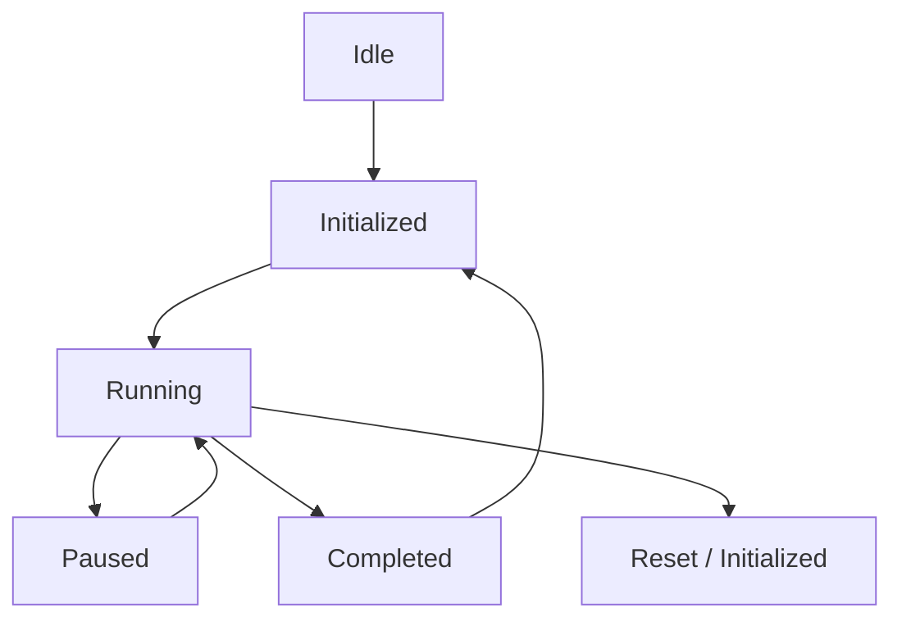

# Training Engine Architecture Specification (Phase 3.2)

**Document Version:** 1.0.0  
**Status:** Canonical Engineering Specification  
**Target Path:** `doc/training-dynamics/training-engine.md`  
**Phase:** Phase 3.2 Engine Refactor  

---

## 1. Overview & Purpose

The **Training Engine** (`lib/training/engine/`) refactors the simulation engine into a pure, reusable execution engine decoupled from React, Canvas 2D rendering, and HTML DOM lifecycles.

The engine takes a canonical DAG `TopologyGraph` as input and emits canonical `EngineState` snapshots as output.

### Core Principles
1. **Canonical State Output (`EngineState`):** All output states are 100% serializable primitive structures containing zero Canvas 2D contexts, React refs, or DOM element references.
2. **Topological Order Execution:** Execution is scheduled by `TopologyScheduler` along valid DAG topological order rather than hardcoded array indices.
3. **Deterministic State Machine:** Manages state transitions (`Idle` $\rightarrow$ `Initialized` $\rightarrow$ `Running` $\rightarrow$ `Paused` $\rightarrow$ `Completed` $\rightarrow$ `Reset`) via `EngineStateMachine`.
4. **Typed Event System:** Broadcasts typed engine events (`EngineInitialized`, `NodeExecuted`, `EdgeTraversed`, `MetricsUpdated`) via `EngineEventEmitter`.
5. **No Autograd at Runtime:** Operates closed-form educational approximation models without dynamic backpropagation tensors or Python frameworks.

---

## 2. Engine Architecture & File Structure

```text
lib/training/
├── engine/
│   ├── engine.ts              # Main TrainingEngine orchestrator class
│   ├── engine-state.ts        # Canonical EngineState snapshot and factory
│   ├── engine-types.ts        # EngineStatus, EngineConfig, EngineSnapshot, EngineContext
│   ├── execution-context.ts   # Runtime step & iteration context manager
│   ├── state-machine.ts       # Deterministic EngineStateMachine transition guard
│   ├── scheduler.ts           # TopologyScheduler DAG execution scheduler
│   └── engine-events.ts       # EngineEventEmitter and typed event definitions
└── index.ts                   # Public barrel API exporting all Phase 3.1 & 3.2 types
```

---

## 3. Engine Lifecycle & State Machine



---

## 4. `EngineState` Contract

```ts
export interface EngineState {
  readonly status: EngineStatus;
  readonly topology: TopologyGraph;
  readonly activeNodes: readonly string[];
  readonly activeEdges: readonly string[];
  readonly currentStep: number;
  readonly currentEpoch: number;
  readonly currentIteration: number;
  readonly metrics: Readonly<Record<string, number>>;
  readonly timestamp: number;
  readonly metadata: Readonly<Record<string, unknown>>;
}
```

---

## 5. Extension Strategy for Future Domains

Because the `TrainingEngine` relies on generic `TopologyGraph` objects and `EngineState` snapshots, it easily extends to:
- **CNNs & ResNets:** Layer nodes & skip connection edges.
- **Transformers:** Multi-head attention nodes & KV cache edges.
- **GNNs:** Non-Euclidean message passing DAGs.
- **Reinforcement Learning:** MDP state-action-reward graphs.
- **Neural Architecture Search (NAS):** Dynamic DAG search spaces.
